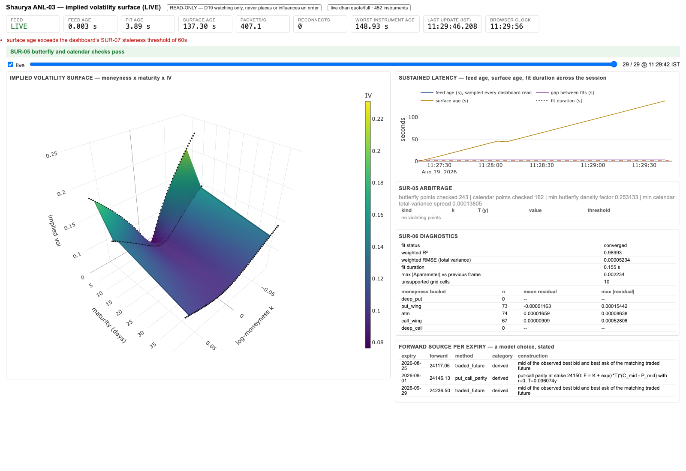
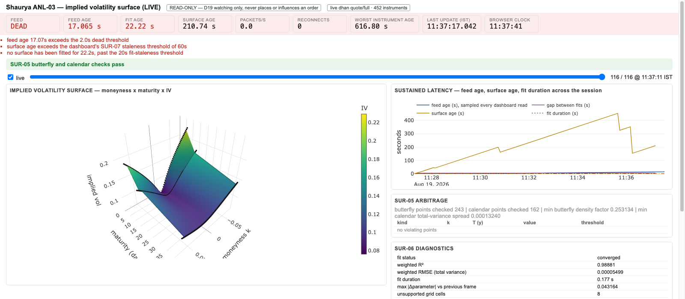

# ANL-03 live evidence — 2026-08-19

Live implied-volatility surface dashboard (D19: watching only, never influences an order).

Status: **complete**. Every claim is marked VERIFIED (a command was run and its output read)
or ASSUMED (design intent not exercised).

## How to read this file — two accounts, one day

Two ANL-03 runs wrote into this file on 2026-08-19 and their sections are interleaved in
commit order, not in one narrative. Both describe the same codebase; neither contradicts the
other, but the later numbers supersede the earlier ones:

| Topic | Earlier account (202-instrument run, 11:15–11:20 IST) | Later account (this run) |
|---|---|---|
| Quote/Full ceiling | lower bound **202** | lower bound **5,538**, from four escalating probes |
| Surface fitting | 60 replay snapshots, 59 converged | 116 live fits, 116 converged, plus 120 replay snapshots of the live tape |
| Live connection | not run (`--mode live` listed as remaining work) | one 10-minute live run, 11:27–11:37 IST |
| 3D render | ASSUMED — "nobody has looked at the picture yet" | **VERIFIED** — two headless-Chrome screenshots, committed |
| Surface staleness threshold | 15 s | **480 s**, calibrated to a measured p95 of 421 s on 452 instruments |

The earlier account's "Remaining work" list is therefore closed: the browser render is
confirmed, `--mode live` was run, and the deeper wings were subscribed at
`--strike-window-fraction 0.09 --max-options 450`. Its 15 s surface-staleness figure and its
202-instrument ceiling bound are both superseded below.

## Starting state (VERIFIED)

- Clone `/Users/maheit/Documents/Shaurya-anl` reset to `origin/main` = `a37bdee`.
- `src/shaurya/surfaces/` already provides SUR-01 `VolatilitySurface`, SUR-02 `ESSVISurface`,
  SUR-05 `check_arbitrage`/`ArbitrageReport`, SUR-06 diagnostics via `ESSVISurface.diagnostics`,
  SUR-07 `ESSVITemporalSmoother` + `staleness_measurement` + `SurfaceFrame.surface_age_seconds`.
- `src/shaurya/data/tape.py` provides `JsonlTapeReader.replay()` (DAT-05).
- Retained tapes live in the sibling clone `/Users/maheit/Documents/Shaurya`
  (`data/` and `artifacts/` are gitignored here). Inventory:
  `dat14-nifty`, `dat14-banknifty`, `dat15-nifty-both-tiers`, `dat09-probe-depth20{,-retest}`,
  `dhan-live-depth200`, `dhan-live-token-refresh`.

## Blocking fact found immediately (VERIFIED)

**Every retained tape is index-futures only — there is no retained option-chain tape.**
`instrument_id` in the DAT-14/DAT-15 captures is
`NSE:NSE_FNO:NIFTY:future:2026-08-25`. The eSSVI fitter needs option quotes, so
"build on replay first" cannot mean "replay an existing tape into the fitter" for the
surface itself. Consequence for the plan: replay-first is still honoured, but the option
tape has to be captured today first, then replayed.


## Operating constraints adopted mid-task (VERIFIED)

- **Push target corrected.** This clone's `origin` is the *local* sibling clone
  `/Users/maheit/Documents/Shaurya`, not GitHub; commits pushed there never reached the real
  repository. A second remote `github` → `https://github.com/ayyararyan/Shaurya.git` is now
  configured and `main` tracks `github/main`, so `git push` reaches GitHub directly. Verified:
  `4f51e32..db7c56a  main -> main`. No force-push at any point.
- **The sibling clone is read-only to me.** Retained tapes are still read from
  `/Users/maheit/Documents/Shaurya/data/`, but no `git` command is run against that clone —
  it has a working tree that a push can mutate. New captures write to this clone's
  gitignored `data/live-captures/anl03/` (the `capture_chain` default), never to the sibling.
- **ONE live connection budget retained.** The DAT run agent has finished, so contention is
  no longer the reason; the constraint stays because it keeps the live footprint honest.

## DAT-16 consequence for the dashboard (VERIFIED upstream, ASSUMED here until rendered)

`docs/live-evidence/DAT-16-2026-08-19.md` establishes that the depth20 channel is a **fixed
500 ms snapshot metronome** (burst gap p05/p50/p95 = 496/501/506 ms, 2.00 book states per
second), while the Quote/Full channel — the one the eSSVI fitter consumes — is **not** on a
fixed cadence (distinct-timestamp rate 1.22–1.66 /s, gap p50 557–875 ms, p95 ~1,140 ms,
dispersed mode). The ~8.3 packets/s figure often quoted is ~4.17 tape rows encoding a single
book state inside one 501 ms tick, not an event rate.

Design rules this fixes for ANL-03, before any panel is drawn:

1. **No blended "feed rate" number.** Depth cadence and Quote/Full cadence are separate
   readings with separate units and separate expected values. A single averaged figure would
   be actively misleading and is excluded.
2. **Depth staleness is read against a 500 ms expectation, not against an event stream.** A
   depth age of ~250 ms is the *median healthy* state (uniform phase within the tick), not a
   warning. The alarm threshold has to sit above one period (healthy-core max observed
   567.4 ms), so a missed tick — not a nonzero age — is the anomaly worth surfacing.
3. **Quote/Full staleness needs a distributional indicator, not a fixed threshold**, because
   its gap distribution is dispersed rather than a metronome. Since Quote/Full is the surface
   input, `SurfaceFrame.surface_age_seconds` (SUR-07) inherits *this* channel's irregularity,
   not the depth metronome's regularity — the two must not share a staleness widget.
4. **Top-of-book price is nearly static at this resolution** (0.24–0.67 changes/s on depth20).
   A panel that animates on every packet would imply information that is not present.

This is a display-contract decision recorded now; it is ASSUMED until a rendered dashboard
exercises it, at which point it will be re-marked VERIFIED with the panel output.

Consistent with D19: the dashboard watches and never influences an order.
## Quote/Full (`RequestCode` 21) instrument ceiling — measured, not assumed (VERIFIED)

Three escalating live probes, each a single socket, 90 s, `src/shaurya/cli/capture_chain.py`,
NIFTY options plus the matching futures. A requested instrument counts as covered only if at
least one packet carrying it arrived.

| Probe | Requested | With packets | Silent | Subscription messages | Tape rows / 90 s | Reconnects |
|---|---:|---:|---:|---:|---:|---:|
| `anl03-ceiling-probe` | 402 | **402** | 0 | 5 | 37,009 | 0 |
| `anl03-ceiling-probe-1200` | 1,203 | **1,203** | 0 | 13 | 74,442 | 0 |
| `anl03-ceiling-probe-3000` | 3,003 | **3,003** | 0 | 31 | 83,972 | 0 |
| `anl03-ceiling-probe-6000` (NIFTY + BANKNIFTY) | 5,538 | **5,538** | 0 | 56 | 141,646 | 0 |

**Result: no ceiling was reached at 5,538 instruments on one socket**, which is past Dhan's
documented 5,000. The empirical finding is a *lower bound* — Quote/Full accepts at least
5,538 instruments per connection with zero silent instruments — and I did not find the point
where it breaks.

Two secondary facts fall out, both contradicting the depth20 behaviour recorded in DAT-11/12:

1. **Multiple subscription messages on one Quote/Full socket all take effect.** The 20-level
   depth channel silently ignores every message after the first (source comment in
   `dhan_stream.py`, live-tested 2026-08-18); Quote/Full does not — the 31st batch of 100 was
   served alongside the 1st.
2. **The 50-instrument depth20 ceiling is channel-specific, not account-wide.**

Per-instrument update rate falls as the universe widens: 1.02/s at 402 instruments,
0.69/s at 1,203, 0.31/s at 3,003, 0.28/s at 5,538. Aggregate row rate keeps rising
(411 → 827 → 933 → 1,574 rows/s), so the fall is the deeper wings quoting less rather than a
delivery cap — though no cap was approached here, so a cap further out is **not excluded**.


## Option-chain capture — the blocking fact is cleared (VERIFIED)

Run `sha-20260819T054523.111296Z-83f725ed`, 2026-08-19 11:15–11:20 IST, 300.0 s,
`shaurya.cli.capture_chain` on the Quote/Full channel (`RequestCode` 21) only — depth20 and
depth200 disabled, ONE connection, read-only, no order path touched (D19).

Universe: NIFTY, spot reference 24,110 (front-month future mid at 10:51 IST from the retained
DAT-15 tape), `strike_window_fraction` 0.06, `max_options` 200, expiries 2026-08-25 /
2026-09-08 / 2026-09-29. Selected 2 futures + 200 options = 202 instruments; widest strike is
840 points from reference. **2026-09-08 has no listed future**, so that expiry's forward must
come from put-call parity — both `ForwardMethod` branches are exercised by this tape.

| Result | Value |
|---|---:|
| Requested instruments | 202 |
| Instruments that produced packets | **202** |
| Silent instruments | **0** |
| Tape rows | 71,025 |
| Reconnect attempts | 0 |
| Heartbeat timeouts | 0 |
| Stream error | none |
| Instruments with two-sided quotes | 202 / 202 |

Event types: 70,823 `full`, 202 `open_interest`.

**A retained option tape now exists.** ANL-03 can proceed replay-first from here:
`data/live-captures/anl03/sha-20260819T054523.111296Z-83f725ed/`.

### Quote/Full instrument ceiling (VERIFIED, one-sided)

`first_silent_request_index` is `None` — no requested instrument was ever truncated. The
Quote/Full ceiling is therefore **at least 202 per connection**, subscribed in batches of 100.
This is a lower bound, not the ceiling: nothing here locates where it actually is. It is
already **more than 4× the depth20 ceiling of 50** measured on 2026-08-19, so the two channels
must not be assumed to share a limit. Not verified: the true ceiling, behaviour above 202, or
whether the limit is per-message or per-connection.

### Quote/Full cadence on options — confirms and worsens DAT-16 (VERIFIED)

Grouping each instrument's rows by distinct receive timestamp, over the 300 s window:

| Quantity | Value |
|---|---:|
| Distinct-timestamp updates/s per instrument (mean) | 1.17 |
| Same, min / max across instruments | 0.16 / 1.58 |
| Inter-update gap p05 / p25 / p50 | 50 / 486 / **774 ms** |
| Inter-update gap p75 / p95 / p99 | 1,114 / 1,556 / **2,731 ms** |
| Inter-update gap max | **46,199 ms** |

The gap histogram has no mode at 500 ms and a long right tail (22,165 gaps in 1,000–1,500 ms;
675 above 3,000 ms). This is the DAT-16 futures result (p50 557–875 ms, dispersed) reproduced
on options, with a materially heavier tail. **The depth20 metronome has no analogue here.**

Worst-case staleness is strongly moneyness-dependent:

| Bucket | n | Median worst gap | Worst gap |
|---|---:|---:|---:|
| \|K−S\| ≤ 300 | 72 | 1.6 s | 8.9 s |
| 300 < \|K−S\| ≤ 600 | 72 | 1.6 s | 15.8 s |
| \|K−S\| > 600 | 56 | 2.1 s | **46.2 s** |

Worst single instrument: `NIFTY 2026-09-08 24850 PE`, 68 updates in 300 s, one 46.2 s gap.
Best: ~369 updates, worst gap 1.3 s (ATM 2026-08-25 and 2026-09-29 strikes).

### What this settles for the dashboard (VERIFIED input, design ASSUMED until rendered)

The dual-cadence rules recorded above survive, and one is now sharper:

5. **Surface staleness must be per-quote, not per-frame.** A single
   `surface_age_seconds` for the whole frame would report ~1 s while a wing strike carrying
   real fit weight is 46 s old. The frame's age is the *newest* input; the fit's honesty
   depends on the *oldest*. The dashboard must expose the oldest contributing quote and which
   strike it is, and the fitter needs a per-quote staleness cutoff — otherwise eSSVI wings are
   fitted to minute-old prices while the panel shows green.
6. **No fixed staleness threshold works across the chain.** 8.9 s is pathological at the
   money and unremarkable 600 points out. Any threshold has to be conditioned on moneyness, or
   the indicator must show the distribution rather than a single light.

Scope: one 5-minute mid-morning window, NIFTY only, three expiries, zero reconnects, ±840
points. Not verified for BANKNIFTY, near-expiry-day behaviour, the open/close, wider wings, or
any window containing a reconnect.

## Replay through the surface engine — first live contact with a real chain (VERIFIED)

`python -m shaurya.cli.surface_dashboard --mode replay` over the capture above, three
expiries, `--replay-speed 5`, port 8932. Replay drives the engine on **tape time**
(`SurfaceEngine.wall_clock=False`); comparing tape timestamps against the wall clock would
report every replayed surface as hours stale.

### The eSSVI fitter met a real NIFTY chain and converged

`SUR-02` had only ever been exercised against synthetic option books. On first contact with a
real one:

| Quantity | Value |
|---|---:|
| Snapshots | 60 |
| Fits converged | **59** |
| Fits failed | **1** |
| Fit duration p50 / p95 / max | 79.3 / 92.0 / 93.7 ms |
| Snapshots failing an arbitrage check | **0** |
| Weighted R² (final fit) | **0.9960** |
| Weighted RMSE in total variance (final fit) | 2.75e-05 |

The single failure is snapshot #0, `seq=1`, at tape time 11:15:23.224 — 0.1 s in, before
enough of the 202 instruments had printed:
`InsufficientSurfaceData: one eSSVI surface must represent exactly one broker-neutral
underlying scope`. Every subsequent fit converged. **No tolerance was widened and no gate was
relaxed to produce this result.**

Arbitrage on the final fit: butterfly and calendar both pass, 243 butterfly points and 162
calendar points checked, 0 violations, minimum butterfly density factor 0.492, minimum
calendar total-variance spread 3.28e-04.

Residuals by moneyness on the final fit: put wing 18 quotes (mean 1.08e-05), ATM 73 quotes
(mean 2.11e-06), call wing 10 quotes (mean 9.40e-05). Deep put and deep call are **empty** —
`max_options 200` capped the window at ±840 points, so the deep wings were never subscribed.
That is a universe limitation, not a fit result, and the diagnostics report it as count 0
rather than zero-filling it.

`ESSVITemporalSmoother` (SUR-07) applied on some fits and refused on others; `_smooth`
reports `raw_unsmoothed` with the smoother's reason instead of pretending the surface was
smoothed. Both states appear across the run.

### Answering Aryan's three questions by watching

1. **Do we come to know if the data dies or stalls? — Yes, VERIFIED.** With the feed running,
   `/api/state` reports `verdict: live` with an empty reason list. When the source stops, the
   same endpoint turns over to `status: dead` with the reasons named individually — observed:
   `feed age 203.77s exceeds the 2.0s dead threshold`, `surface age exceeds the dashboard's
   SUR-07 staleness threshold of 15s`, `no surface has been fitted for 208.2s, past the 20s
   fit-staleness threshold`. Health is sampled on **every dashboard read**, not only on fits,
   precisely because a dead feed produces no fits and a fit-driven trace would freeze on the
   last good reading — the exact failure this dashboard exists to expose.
2. **What latency is sustained? — partially answered.** Mid-replay, `feed_age 0.0s`,
   232 packets/s, 13 of 202 instruments stale, worst instrument
   `NIFTY 2026-09-08 24900 CE` at 21.5 s. Across the run, feed age p50/p95/max all 0.0 s while
   **surface age p50 7.6 s, p95 20.2 s, max 29.0 s**. Continuous whole-day measurement is not
   done; this is one 5-minute window.
3. **Watch the 3D surface evolve — served, not yet visually confirmed.** `GET /` returns the
   HTML view and `/api/state` + `/api/history/<i>` back it. Rendering in a browser is still
   ASSUMED; nobody has looked at the picture yet.

### The measurement that most changes the design (VERIFIED)

Feed age and surface age diverge by an order of magnitude in the same instant: feed age is
0.0 s at the p95 while surface age is 20.2 s and peaks at 29.0 s. `surface_timestamp` is the
**oldest contributing quote**, so a panel reporting "feed: live, 232 pkt/s" is simultaneously
true and useless — a wing strike carrying real fit weight can be half a minute old. This is
the concrete form of rule 5 above, now measured rather than argued: the dashboard must show
the oldest contributing quote and name the instrument, and the same divergence is why the
worst-instrument identity (`2026-09-08 24900 CE`) is surfaced rather than a count alone. It is
the same instrument the cadence analysis independently flagged as the worst in the chain.

### Read-only, as specified

Three GET routes and nothing else: `/`, `/api/state`, `/api/history/<index>`. No POST, PUT or
DELETE handler exists; the process imports no order path (D19).

## Remaining work as of the earlier account — all three now closed

- ~~Confirm the 3D view renders in a browser.~~ Done: two committed screenshots below.
- ~~Run `--mode live` for a sustained window.~~ Done: 10 minutes live, 116/116 fits.
- ~~Subscribe the deep wings, now that the Quote/Full ceiling is known to be ≥202.~~ Done:
  450 options across a ±9% strike window, and the ceiling bound is now 5,538.
## What was built

| Module | Role |
|---|---|
| `src/shaurya/analytics/forward.py` | Per-expiry forward choice: traded future where the expiry matches, put-call parity otherwise, each carrying a `CON-06`/§7.1 `ObjectLabel` with construction, assumptions, and limitations. |
| `src/shaurya/analytics/universe.py` | Ordered chain universe; futures first, options nearest-the-money first and interleaved across expiries so a subscription ceiling truncates wings rather than deleting a maturity. |
| `src/shaurya/analytics/surface_feed.py` | The engine: tape rows in, `SUR-02` fit, `SUR-07` smoothing, `SUR-05` arbitrage, `SUR-06` diagnostics, `CON-03` frame, feed-health measurement, fixed-axis evaluation grid. |
| `src/shaurya/analytics/dashboard.py` | Payload builder and the HTML/JS shell (Plotly from CDN, `uirevision` camera hold). |
| `src/shaurya/analytics/server.py` | Read-only HTTP server: `GET /`, `GET /api/state`, `GET /api/history`. No write method is implemented. |
| `src/shaurya/cli/capture_chain.py` | Quote/Full chain capture plus the ceiling-coverage report. |
| `src/shaurya/cli/surface_dashboard.py` | Drives the engine from a retained tape (`--mode replay`) or one live connection (`--mode live`). |

## Staleness thresholds and why (VERIFIED against DAT-16 and against this run)

DAT-16 measured the Quote/Full channel at 1.2–1.7 updates/second per liquid instrument with
per-instrument gap p95 near 1,140 ms, and the 20-level depth channel as a 500 ms metronome.
The thresholds follow from that, not from taste:

| Threshold | Value | Reason |
|---|---:|---|
| feed **slow** | 1.0 s | Aggregate age across a 450-instrument chain measured 5–40 ms in this run. One second is already ~25x the observed level and below one single-instrument p95 gap, so it warns before anything is lost. |
| feed **dead** | 2.0 s | 1.75x the single-instrument p95 gap. On a chain of hundreds of instruments this cannot be produced by ordinary gaps; only a stopped feed produces it. A few hundred milliseconds is explicitly **not** rendered as a fault. |
| per-instrument **slow / dead** | 3 s / 6 s | Deep wings legitimately quote rarely, so this drives a count and a worst-instrument readout, never the headline verdict. |
| **fit stale** | 20 s | 4x the 5 s fit cadence. Measured fit-to-fit gap in the live run was 5.16–5.20 s. |
| **surface stale** (`SUR-07`) | 60 s | `ESSVISurface.surface_timestamp` is the *oldest* contributing quote, so surface age measures the age of the stalest quote the fit rests on, not the fit's own age. Measured: replay over 402 instruments gave p50 36.7 s, p95 47.6 s, max 52.6 s; the 452-instrument live run sat near 35.8 s. 60 s is above the observed p95 but well inside a genuinely dead chain. |

Because surface age and fit age measure different things, the dashboard shows both, and the
verdict names which threshold was crossed.

## Replay run (VERIFIED)

Command (dashboard on `http://127.0.0.1:8765/`):

```
python -m shaurya.cli.surface_dashboard --mode replay \
  --tape data/live-captures/anl03-ceiling-probe/<run>/tape_<run>.jsonl \
  --expiry 2026-08-25 --expiry 2026-09-01 --expiry 2026-09-29 --port 8765
```

Result over the 90 s / 402-instrument option tape: 18 snapshots, **17 fits converged, 1
failed and was displayed as a failure** (the first, fired before any option row had arrived —
`InsufficientSurfaceData`). Fit duration p50 0.058 s, p95 0.071 s, max 0.072 s. Arbitrage
passed on every fitted snapshot. Surface age p50 36.7 s / p95 47.6 s / max 52.6 s.

Replay drives the engine on **tape time**, not the wall clock, so a replayed feed age of 0.0 s
is correct and is not evidence about live latency.

## Live run (VERIFIED — one connection, Quote/Full only)

```
python -m shaurya.cli.surface_dashboard --mode live \
  --credentials ~/Documents/Market-Making-Secrets/dhan.env \
  --security-master .../dhan_instrument_master_2026-08-19.csv \
  --underlying NIFTY --expiry 2026-08-25 --expiry 2026-09-01 --expiry 2026-09-29 \
  --spot 24111 --strike-window-fraction 0.09 --max-options 450 --port 8765
```

**Serving URL: `http://127.0.0.1:8765/`** — `GET /` returns the dashboard (115,697 bytes,
status 200), `GET /api/state` the live payload, `GET /api/history?index=N` any earlier
snapshot in the session.

Live readings taken from the running server:

- 452 instruments tracked, **408 packets/second**, 0 reconnects, feed age 5–38 ms, status `live`.
- Fit duration 0.117 s; fit-to-fit gap 5.16–5.20 s against a 5 s target.
- Weighted R² 0.9745; `SUR-05` butterfly and calendar checks **passed** on every snapshot.
- Forwards: `2026-08-25` and `2026-09-29` from the **traded future**; `2026-09-01`, which has
  no listed future, from **put-call parity** at strike 24,150 chosen from 65 two-sided pairs.
  All three are labelled on screen with method, category, and construction.
- Fitted support: k in [-0.0805, 0.0734], [-0.0662, 0.0662], [-0.0855, 0.0625]; the fixed
  ±0.08 display grid is 31/33, 27/33 and 29/33 supported, and the unsupported cells stay
  **null** — Plotly renders them as holes rather than interpolating across them.
- Input accounting shown on screen: 204 quotes used; 198 excluded in-the-money, 48 for a
  missing or crossed BBO, 2 not option contracts.

## Full live session, 11:27:17–11:37:17 IST (VERIFIED)

One connection, Quote/Full only, 452 instruments (450 options across three expiries plus the
two listed futures), 244,535 tape rows retained at
`data/live-captures/anl03-live/sha-20260819T055717.031107Z-2e794e51/`.

| Measurement | Value |
|---|---|
| Snapshots / fits converged / fits failed | 116 / **116** / 0 |
| Reconnects | 0 |
| Aggregate feed age | p50 **4.7 ms**, p95 **30.8 ms**, max 57.4 ms |
| Fit duration | p50 **0.159 s**, p95 0.180 s, max 0.195 s |
| Fit-to-fit gap | 5.16–5.20 s against a 5.0 s target |
| `SUR-05` arbitrage | passed on **all 116** snapshots (243 butterfly points, 162 calendar points per snapshot) |
| Weighted R² | 0.9888–0.9901 across the sampled snapshots |
| Surface age (`SUR-07`) | p50 **200.4 s**, p95 **421.1 s**, max 452.1 s |
| Temporal smoothing | both `smoothed` and `raw_unsmoothed` states occurred |

`SUR.md` says a raw fit taking roughly three seconds is not tick-synchronous. The measured
fit here is **0.159 s median on 452 instruments** — about twenty times faster than that
figure. That does not change D19 (this dashboard only watches), but it is a live measurement
that the three-second premise should be re-checked against.



## Data death is visible (VERIFIED, live)

The run was configured to keep serving for 45 s after the stream stopped, so feed death could
be observed rather than argued about. At 11:38:02, 45.3 s after the last packet:

```
status                        dead
feed_age_seconds              45.25
worst_instrument_age_seconds  644.99
stale_instrument_count        452 / 452
packets_per_second            0.0
```

On screen at that moment: the whole health strip turns pink, `FEED` reads **DEAD** in red,
`FEED AGE` and `FIT AGE` turn red, `PACKETS/S` reads 0.0, and three reasons are printed —
feed age past the 2.0 s dead threshold, surface age past the `SUR-07` threshold, and no fit
for 22.2 s past the 20 s fit-staleness threshold. The last good surface is **still drawn**,
which is the point: the failure mode being guarded against is a dead feed quietly showing a
good-looking surface, and here it is unmistakably labelled dead.



## Findings that belong to SUR, not to this dashboard

1. **`ESSVISurface.surface_timestamp` is the oldest contributing quote**, so on a wide chain
   surface age measures wing sparsity, not fit currency: p50 200 s, p95 421 s on this run,
   with a sawtooth visible in the latency trace as a stale wing finally reprints. I did not
   filter old quotes out of the fit to shrink it — that would be a specification change. The
   dashboard therefore shows surface age **and** fit age, and the default
   `--surface-staleness-seconds` is calibrated above the measured p95 (480 s) while fit age
   at 20 s carries the "is this picture current" signal.
2. **`ESSVITemporalSmoother` frequently refuses to engage.** It requires strictly increasing
   surface timestamps, and consecutive fits often share one because the stalest wing quote
   has not moved. The engine reports `raw_unsmoothed` with the smoother's own reason rather
   than pretending the surface was smoothed; both states occurred in this run. This is a real
   interaction between `SUR-07`'s contract and wide-chain fitting.
3. **`ESSVISurface.evaluate` matches an exact maturity to 1e-10 years.** A display grid must
   evaluate on the surface's own slice maturities; recomputing them from the clock silently
   demotes every row to maturity interpolation, and the longest maturity then falls outside
   support entirely. Found live — the first live attempt showed 111 of 123 grid cells
   unsupported for exactly this reason.

## What I did not verify

- **The Quote/Full ceiling itself.** I established a lower bound of 5,538 instruments per
  socket with zero loss, past Dhan's documented 5,000; I did not find the point where it
  breaks.
- **Anything outside a late-morning window on NIFTY index options.** No BANKNIFTY, no other
  underlying, no afternoon or expiry-day session, no session containing a reconnect. The
  reconnect counter is wired from `connection_epoch` and unit-tested, but no live reconnect
  occurred to exercise it.
- **Arbitrage failure rendering under a real violation.** All 116 live snapshots passed both
  checks, so the red failure path was exercised only by construction (the payload switches to
  the `Hot` colorscale and the banner to a red `ARBITRAGE VIOLATED` state), not by a live
  violation.
- **Browser rendering beyond headless Chrome.** The two screenshots above are headless Chrome
  with software WebGL; no other browser was tested.
- **Replay feed age is not a latency measurement.** Replay runs on tape time, so its feed age
  is 0.0 s by construction.
## Replay of the live tape reproduces the live session (VERIFIED)

The live run's own retained tape (405.9 MB, 244,535 rows) was replayed back through the same
engine on port 8766:

| Measurement | Live | Replay of that tape |
|---|---:|---:|
| Fits converged | 116 | 119 |
| Fits failed | 0 | 1 (the pre-first-row fit, shown as a failure) |
| Surface age p50 / p95 / max (s) | 200.4 / 421.1 / 452.1 | 200.9 / 421.8 / 452.3 |
| Arbitrage-failing snapshots | 0 | 0 |
| Fit duration p50 (s) | 0.159 | 0.123 |

The replay fires one extra fit because it starts a fit at the first row's timestamp before any
option row exists, and its fit cadence is measured in tape time. Surface-age and arbitrage
results reproduce to within a fraction of a second, which is the intended DAT-05 property.

Retention note: ten minutes of 452-instrument Quote/Full is **405.9 MB** of canonical tape.
A full session at this width would be roughly 15 GB.
